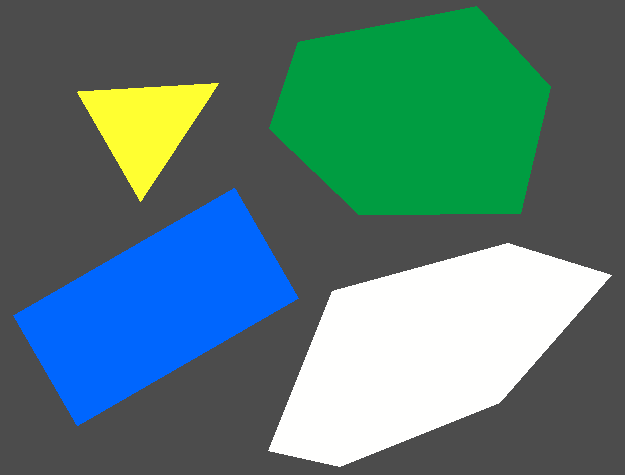
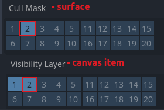

#  Surface2D

Surface2D is a Godot 4 plugin adding polygonal surfaces on which decals can drawn.

## Installation

1. Copy `addons/surface_2d` folder into `addons` directory of your project.

2. Enable this plugin in `Project > Project Settings... > Plugins`.

## Usage

1. Add a new `Surface2D` node to the scene.

2. Draw the shape of your surface by adding points in the scene view.

3. Choose a rendering layer to use for drawing decals (by default it is layer 2).

4. Set `cull_mask` of the surface and `visibility_layer` of the canvas item to that layer.

5. Now when this canvas item intersects with the surface it should be drawn on it.

## Tips

`visibility_layer` and `cull_mask` of the surface itself should **NOT** overlap (or the surface will try to draw itself on itself which normally causes a tsunami of errors).

It is a good practice to name rendering layers, similarly to physics layers, in `Project Settings`.

If a node we want to draw has a parent of canvas item type, then its parent has to also have an appropriate `visibility_layer` set.
In other words, `visibility_layer` propagates down the tree, similarly to how transforms do.

For understanding how mask culling and visibility layers work I recommend [this](https://www.youtube.com/watch?v=UqQyBv4htqw) excellent tutorial.
Surface2D uses mechanisms mentioned there.
