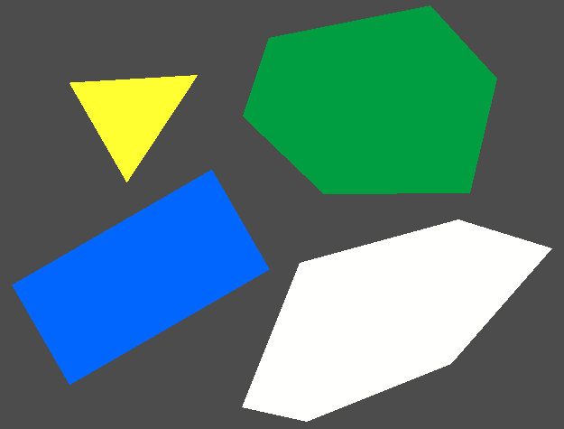
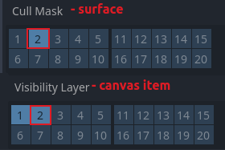

#  Surface2D

Surface2D is a Godot 4 plugin adding polygonal surfaces on which decals can drawn.

## Installation

1. Copy `addons/surface_2d` folder into `addons` directory of your project.

2. Enable the plugin under `Project > Project Settings... > Plugins`.

## Usage

1. Add a new `Surface2D` node to the scene.

2. Draw a shape of your surface by adding points in the scene view.

3. Set `cull_mask` of the surface and `visibility_layer` of the canvas item,
   which you want to draw, to a chosen rendering layer.

4. Now when that canvas item intersects with the surface it should be drawn on it.
   If not, then you might want to refer to the [tips](#tips) section below.

## Examples

This repo cotains a [demo scene](demo/demo.tscn), which showcases some possible applications.

## Default Settings

The default settings for some of the Surface2D properties are stored
under `Project > Project Settings > Addons > Surface 2D > Defaults`.
Changing them requires engine restart, since the scripts have to be parsed again.

## Debugger Tool

Polygons representing surfaces as well as their bounding rects can be made visible in-game
for debugging purposes by checking corresponding options under `Project > Tools > Surface2D Debugger`.
This works only when running the game from the editor, not in exported builds.

## Tips

If a node you want to draw has a parent of `CanvasItem` type,
then that parent has to also have an appropriate `visibility_layer` set.
In other words, `visibility_layer` propagates down the tree, similarly to how transforms do.

`visibility_layer` and `cull_mask` of the surface itself should **NOT** overlap
(or the surface will try to draw itself on itself which normally causes a tsunami of errors).

It is a good practice to organize rendering layers by naming them
accordinly under `Project > Project Settings > Layer Names > 2D Render`.

For understanding how mask culling and visibility layers work I recommend
[this](https://www.youtube.com/watch?v=UqQyBv4htqw) excellent tutorial.

## Inner Workings

Under the hood the plugin uses `SubViewport` and `Camera2D` nodes.
Subviewport has the same `World2D` as the root `Viewport`.
The camera is transformed according to the transform of the `Surface2D` polygon itself.
When it comes to performance, viewports can be quite heavy,
but I haven't yet tested the limits of what this plugin might be able to do.
One optimization technique, if needed, might be making polygons smaller,
but scaling them up to desired size, since this wouldn't require rendering so many pixels.

## License

This plugin is distributed under [MIT License](LICENSE).
